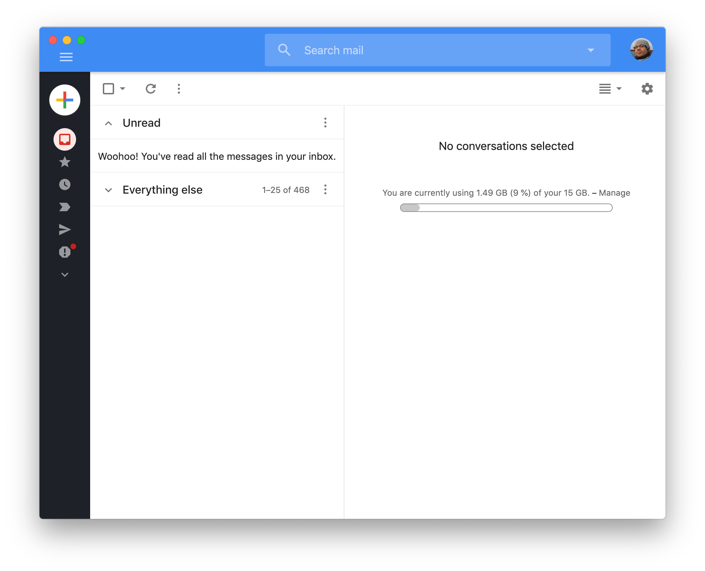

# Gmail packaged as Electron app

This is a thin wrapper around the Gmail web interface built with
[Electron](https://electronjs.org).



## Features

- Native desktop notifications
- Unread messages badge in OS X dock
- Dark sidebar theme
- Many small visual UI improvements

## Download

You can download a binary version for OS X [here](https://github.com/fgnass/gmail-app/releases/latest).

## Building

```
npm install
npm run pack-osx
cp -r Gmail-darwin-x64/Gmail.app /Applications
```

# Disclaimer

This project is not affiliated with, associated to, nor endorsed by Google
in any way. Google, Gmail and the Gmail Logo are registered
trademarks of Google Inc.

The code in this repository has been released to the public domain
under the [UNLICENSE](./UNLICENSE).
